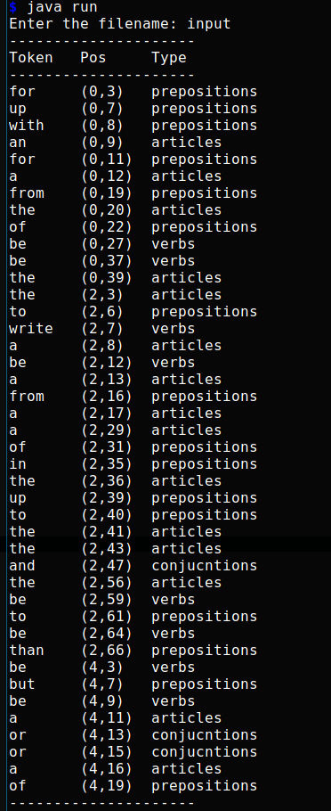

### Readme file

# In order to run the program use the following command:
`$ javac run.java`
`$ java run`

The program asks for an input file. There is sample file provided named as "input" with some random text on it.

# The following is the ouput generated by the sample

 
