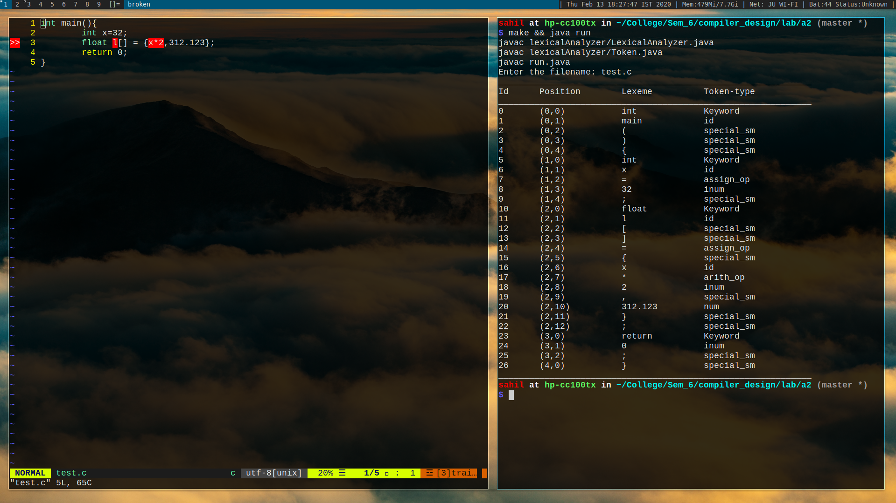

# Readme file

##### All the above files are placed in the package `lexicalAnalyzer`.
The `run.java` class contains the main method and runs the methods in the `LexicalAnalyzer` class.

### In order to run the program use the following command:
compilation: 
`$ make`

Executaion: 
`$ java run`

The program asks for an input file. There is sample file provided named as "test.c" with some random c program on it.
The output is produced in the screen

### The following is the ouput generated by the sample

